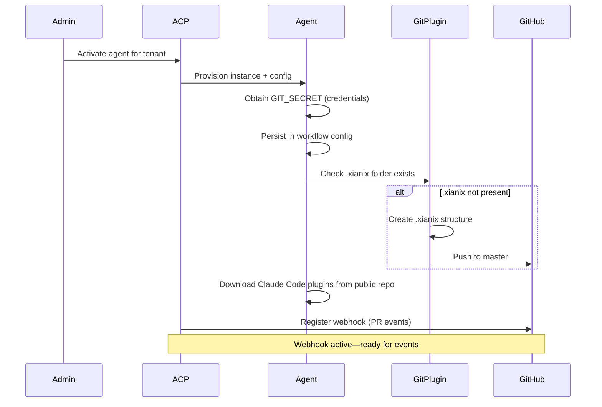
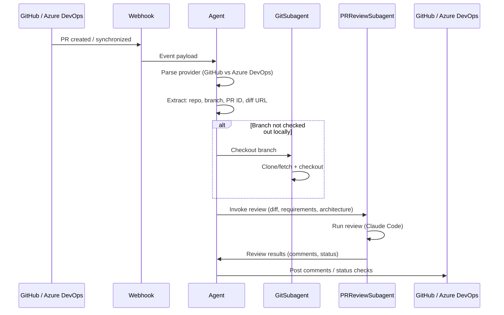
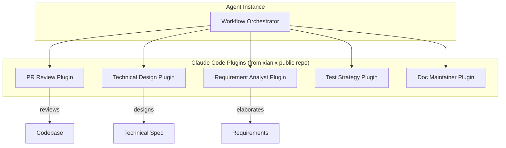
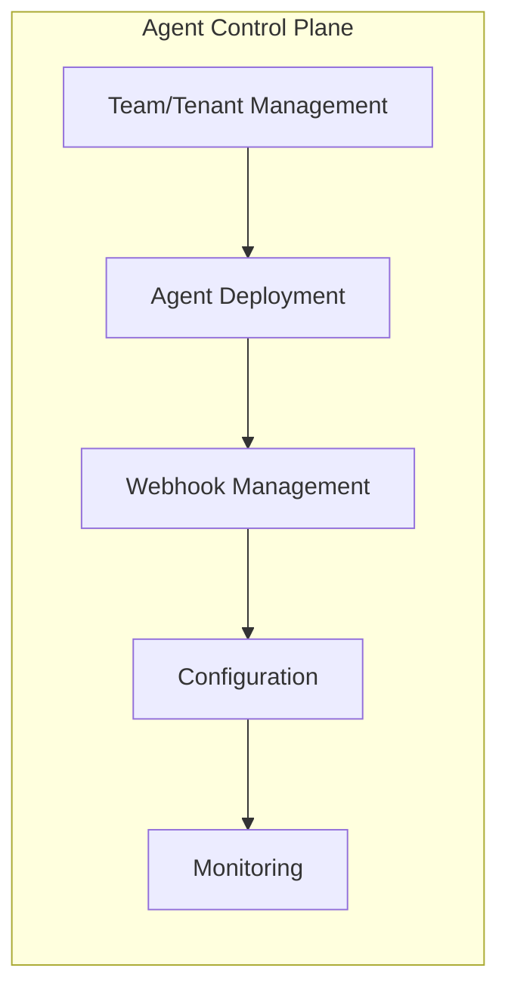
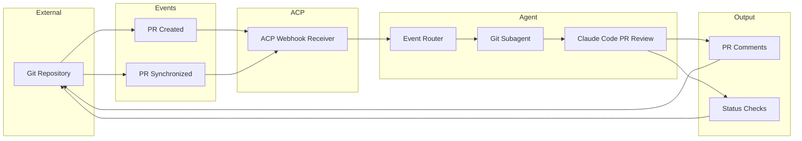
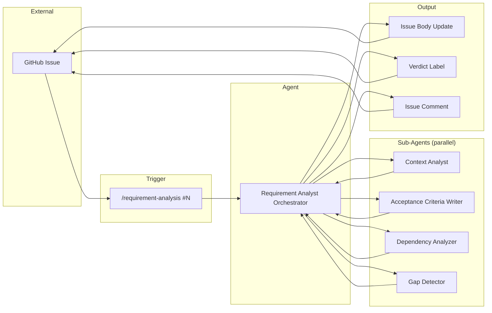

# Agent Architecture

This document describes the technical architecture of the Xianix Team agent system—how agents are provisioned, how they integrate with source control and CI/CD, and how they orchestrate subagents built on Claude Code plugins.

---

## Overview

The agent system is a multi-layered architecture where:

1. **Agent Control Plane (ACP)** provisions and manages agent instances per tenant
2. **Event-driven webhooks** trigger agent workflows (e.g., PR created, PR synchronized)
3. **Claude Code plugins** implement specific job roles (PR review, technical design, etc.)
4. **Git operations** are abstracted to support both GitHub and Azure DevOps

```text
┌─────────────────────────────────────────────────────────────────────────────────┐
│                          XIANIX AGENT ARCHITECTURE                              │
├─────────────────────────────────────────────────────────────────────────────────┤
│                                                                                 │
│  ┌─────────────────┐     ┌─────────────────┐     ┌─────────────────┐            │
│  │   GitHub        │     │  Azure DevOps   │     │  Other Events   │            │
│  │   PR Events     │     │  PR Events      │     │  (future)       │            │
│  └────────┬────────┘     └────────┬────────┘     └────────┬────────┘            │
│           │                       │                       │                     │
│           └───────────────────────┼───────────────────────┘                     │
│                                   ▼                                             │
│  ┌────────────────────────────────────────────────────────────────────────────┐ │
│  │                    Agent Control Plane (ACP)                               │ │
│  │  • Webhook receivers  • Tenant management  • Agent activation              │ │
│  └────────────────────────────────────┬───────────────────────────────────────┘ │
│                                       ▼                                         │
│  ┌────────────────────────────────────────────────────────────────────────────┐ │
│  │                         Agent Instance (per tenant)                        │ │
│  │  • Event routing  • Workflow orchestration  • Subagent coordination        │ │
│  └────────────────────────────────────┬───────────────────────────────────────┘ │
│                                       ▼                                         │
│  ┌────────────────────────────────────────────────────────────────────────────┐ │
│  │                    Claude Code Plugins (Subagents)                         │ │
│  │  PR Review │ Technical Design │ Requirement Analyst │ Test Strategy │ ...  │ │
│  └────────────────────────────────────────────────────────────────────────────┘ │
│                                                                                 │
└─────────────────────────────────────────────────────────────────────────────────┘
```

---

## Setup

When agents are first activated on a tenant, the following bootstrap sequence runs.

### Setup Sequence



### Setup Steps (Detailed)

| Step   | Description                                                                                  |
| ------ | -------------------------------------------------------------------------------------------- |
| **1. Obtain GIT_SECRET** | The agent retrieves repository credentials (token or SSH key) and stores them in tenant configuration. These are passed as workflow parameters to subagents that need Git access. |
| **2. .xianix folder check** | The agent checks if the `.xianix` folder exists in the repository. This folder contains agent-specific configuration (e.g., architecture rules, conventions). If absent, the agent sets up the structure and pushes it to the default branch (master/main). |
| **3. Plugin download** | All Claude Code subagents are downloaded as plugins from the Xianix public GitHub repository. Each plugin corresponds to a software-engineering job role (PR review, technical design, requirement analysis, etc.). |
| **4. Webhook registration** | ACP registers webhooks to listen for external events: `pull_request.created` and `pull_request.synchronized` from both GitHub and Azure DevOps. |

### Webhook Events (Supported)

| Provider      | Events                                              |
| ------------  | --------------------------------------------------- |
| GitHub        | `pull_request.created`, `pull_request.synchronized` |
| Azure DevOps  | `pull_request.created`, `pull_request.synchronized` |

---

## PR Review Flow

The PR Review workflow is the primary event-driven flow. Agents must distinguish between GitHub and Azure DevOps payloads and adapt their behavior accordingly.

### PR Review Sequence



### Provider Abstraction

The agent extracts unified information from provider-specific payloads:

| Field      | GitHub                     | Azure DevOps                       |
| ---------- | -------------------------- | ---------------------------------- |
| Repository | `repository.full_name`     | `resource.repository.id`           |
| Branch     | `pull_request.head.ref`    | `resource.sourceRefName`           |
| PR ID      | `pull_request.number`      | `resource.pullRequestId`           |
| Diff URL   | `pull_request.diff_url`    | REST API diff endpoint             |
| Base ref   | `pull_request.base.ref`    | `resource.targetRefName`           |

### Local Code Checkout

- If the code branch is not present locally, the **Git subagent** performs `git fetch` and `git checkout` so the PR Review subagent has full codebase context.
- The repository path and branch are passed as workflow parameters to downstream subagents.

---

## Claude Code (Subagent Plugins)

Each agent capability is implemented as a **Claude Code plugin**. These plugins represent different job roles in software engineering and are downloaded from the Xianix public GitHub repository.

### Plugin Architecture



### Job-Role Mapping

| Plugin              | Job Role            | Primary Trigger        |
| ------------------- | ------------------- | ---------------------- |
| PR Review           | Code reviewer       | `pull_request.*`       |
| Technical Design    | Solution architect  | Sprint item assigned   |
| Requirement Analyst | Business analyst    | Backlog item created   |
| Test Strategy       | QA engineer         | PR approved            |
| Doc Maintainer      | Technical writer    | Branch merged          |

Plugins are versioned and updated independently. New roles can be added by publishing new plugins to the public repo.

---

## Agent Control Plane (ACP)

The production deployment runs on the **Azure Sovereign AI Agent Platform**. The ACP is the central management layer for all agent instances.

### ACP Responsibilities



| Capability           | Description                                                                                       |
| -------------------- | -----------------------------------------------------------------------------------------------   |
| Tenant management    | Create teams (tenants) for customers. Each tenant has isolated agent instances and configuration. |
| Agent activation     | Deploy agent instances per tenant. Activate or deactivate agents based on subscription/licensing. |
| Webhook management   | Create and manage webhooks to listen to external events (GitHub, Azure DevOps). Register, update, or remove webhook subscriptions. |
| Configuration        | Store tenant-specific config: GIT_SECRET, repository URLs, architecture rules path, plugin versions. |
| Monitoring           | Track agent health, event processing latency, error rates, and audit logs.                       |

### Deployment Model

```text
┌─────────────────────────────────────────────────────────────────┐
│              Azure Sovereign AI Agent Platform                  │
├─────────────────────────────────────────────────────────────────┤
│                                                                 │
│  Tenant A          Tenant B          Tenant C                   │
│  ┌─────────┐      ┌─────────┐      ┌─────────┐                  │
│  │ Agent 1 │      │ Agent 2 │      │ Agent 3 │                  │
│  │ +hooks  │      │ +hooks  │      │ +hooks  │                  │
│  └─────────┘      └─────────┘      └─────────┘                  │
│       │                  │                  │                   │
│       └──────────────────┼──────────────────┘                   │
│                          ▼                                      │
│              ┌─────────────────────┐                            │
│              │  Shared Infra       │                            │
│              │  • Claude API       │                            │
│              │  • Plugin registry  │                            │
│              └─────────────────────┘                            │
│                                                                 │
└─────────────────────────────────────────────────────────────────┘
```

---

## Example Workflow: PR Review (End-to-End)

A complete flow from PR creation to review feedback.

### Flow Diagram



### Step-by-Step

| Step | Component             | Action                                                                 |
| ---- | --------------------- | ---------------------------------------------------------------------- |
| 1    | Git Repository        | Developer creates or updates a PR                                      |
| 2    | GitHub/Azure DevOps   | Sends `pull_request.created` or `pull_request.synchronized` webhook    |
| 3    | ACP Webhook           | Receives event, routes to tenant's agent instance                      |
| 4    | Agent                 | Parses event, extracts repo/branch/PR info                             |
| 5    | Git subagent          | If needed, checks out the PR branch locally                            |
| 6    | Claude Code PR Review | Runs review against requirements, architecture rules, code standards   |
| 7    | Agent                 | Posts review as PR comments and/or status checks                       |

---

## Data Flow Summary

```text
 Git Repository
       │
       │  PR created / synchronized
       ▼
 ACP Webhook ──────► Agent Instance
       │                    │
       │                    ├─► Git Subagent (checkout)
       │                    │
       │                    └─► Claude Code PR Review
       │                              │
       │                              ▼
       │                        Review output
       │                              │
       ▼                              ▼
 Git Repository ◄──────────── PR comments / status checks
```

---

## Example Workflow: Requirement Analysis (End-to-End)

A complete flow from backlog item creation to elaborated requirement.

### Flow Diagram



### Step-by-Step

| Step | Component                    | Action                                                                                  |
| ---- | ---------------------------- | --------------------------------------------------------------------------------------- |
| 1    | User / Automation            | Invokes `/requirement-analysis <issue-number>` (optionally with `--comment`)            |
| 2    | Orchestrator                 | Fetches issue metadata (title, body, labels, assignee, comments) via GitHub MCP          |
| 3    | Orchestrator                 | Classifies item: type (story/task/bug/spike), domain, complexity                        |
| 4    | Context Analyst              | Searches codebase for affected modules, related issues, architectural patterns           |
| 5    | Acceptance Criteria Writer   | Writes testable Given/When/Then criteria covering happy path, errors, edge cases         |
| 6    | Dependency Analyzer          | Maps upstream/downstream/external dependencies, risks, and constraints                   |
| 7    | Gap Detector                 | Identifies ambiguities, missing info, contradictions; assigns severity (Critical/Warning/Info) |
| 8    | Orchestrator                 | Aggregates sub-agent outputs into elaborated requirement with verdict                    |
| 9    | Orchestrator                 | Posts result to GitHub: updates issue body (or adds comment), applies verdict label      |

---

## Requirement Analysis Data Flow Summary

```text
 GitHub Issue (#N)
       │
       │  /requirement-analysis
       ▼
 Orchestrator (classify + coordinate)
       │
       ├─► Context Analyst ──────────► Affected modules, related issues, patterns
       │
       ├─► Acceptance Criteria Writer ► Given/When/Then criteria, edge cases
       │
       ├─► Dependency Analyzer ──────► Dependencies table, risks, constraints
       │
       └─► Gap Detector ─────────────► Ambiguities, missing info, contradictions
                                              │
                                              ▼
                                     Aggregated output
                                              │
                              ┌────────────────┼────────────────┐
                              ▼                ▼                ▼
                        Issue body       Verdict label     Issue comment
                        update           (groomed /        (if --comment)
                                         needs-clarification /
                                         needs-decomposition)
                              │                │                │
                              └────────────────┼────────────────┘
                                              ▼
                                     GitHub Issue (#N)
```

---

## Related Documents

- [concept.md](concept.md) — Vision, SDLC pipeline, and agent mesh
- [architecture.md](architecture.md) — Architecture fitness rules (used by PR Review agent)
